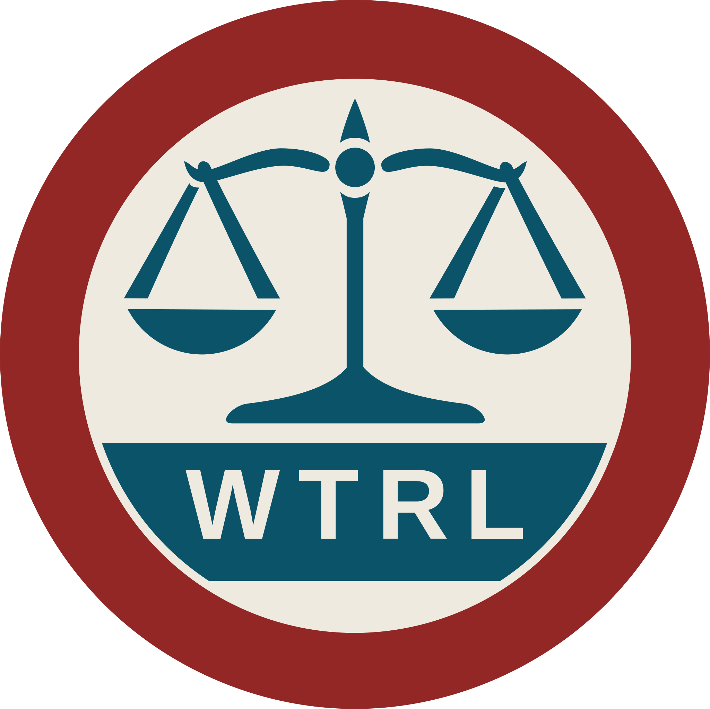

<p align="center">
	
</p>

## README


[](https://pypi.org/project/sdv-doc-waterloo/)

### Install from source

`package_main` contains the Waterloo Python package and the Sphinx extension.
The package can be installed from a local checkout of this repository:

```bash
cd package_main
pip install .
```

If you want to build the documentation with the Sphinx extension, install
the optional extra that provides the external `sphinx` dependency:

```bash
cd package_main
pip install ".[sphinx]"
```

The package can also be installed directly from GitHub:

```bash
pip install "git+https://github.com/uwe-at-sdv/sdv_doc_waterloo.git@main"
```

SSH works as well for authenticated access:

```bash
pip install "git+ssh://git@github.com/uwe-at-sdv/sdv_doc_waterloo.git@main"
```

### Current status

Waterloo is under active development. Recent milestones include:

Current work focuses on the MCP server:

* Bearer-token authentication
* Docker deployment
* Administration tooling

### Quick tutorials

#### waterlint

`waterlint` is the main command-line tool for Waterloo Docstrings.
It validates docstrings, renders Waterloo JSON, generates helper output, and
supports the MCP-related workflows in this project.
Its JSON diagnostics are machine-readable and therefore well suited for CI
pipelines and GitHub workflows.

Start with the general help:

```bash
waterlint -h
```

For topic-specific help, use for example:

```bash
waterlint help --topic validate
waterlint help --topic render-json
waterlint help --topic render-docker
```

One important `waterlint` output path is the MCP server setup: the tool can
validate the server configuration and generate a Docker build script when you
want to package the server as an image.

#### Running the MCP server

The MCP server exposes Waterloo documentation data through the Model Context
Protocol. It is tightly bound to the Waterloo JSON schema and provides tools
that help generate and inspect Waterloo docstrings. It serves the bundled
roots, object details, examples, references, and prompt templates so clients
can inspect the documentation structure without parsing the JSON documents
directly.

After installation, start the server in a terminal with:

```bash
wtrl_mcp
```

This launches the MCP server with the default configuration
``src/sdv/doc/waterloo/mcp/wtrl_mcp.toml`` for access to ``127.0.0.1`` or
``localhost`` on port 13316.
Consult your operating system documentation if you want to run it as a service.

#### Registering the MCP server in Codex or Claude Code

Once the server is running, register it in your CLI client so it can reach the
server without manual setup every time. The exact subcommand syntax depends on
the CLI version, but the pattern is the same:

#### codex

```bash
codex mcp add myserver --url http://127.0.0.1:13316/mcp
```

#### claude

```bash
claude mcp add --transport http myserver http://127.0.0.1:13316/mcp
```

If you prefer `localhost`, use that host name instead of `127.0.0.1`.
If the agent itself runs inside a container or on another host, replace the
address with the one that matches your deployment. The server name is only an
identifier for the client, so you can choose any name that is convenient for
you.

#### Rendering a Docker setup from the MCP configuration

If you want to ship the MCP server as a container, `waterlint` can generate a
Docker build script from the MCP configuration. For example:

```bash
waterlint render-docker --in src/sdv/doc/waterloo/mcp/wtrl_mcp.toml --out /tmp/myserver.docker
```

The generated script contains the Docker build steps and the runtime command
line. It also prints a few practical hints, such as which port mapping to use
and which host names should be allowed for the resulting server. After that,
you can build the image with the generated script and run it in Docker.

### Projects using Waterloo Docstrings

The following projects use Waterloo Docstrings in practice.

**Human-readable HTML**  
[3DE4 Python Scripting Interface](https://3dequalizer.com/user_daten/sections/tech_docs/py_doc/tde4.wtrl.core.rfc-2119.html)  
Interactive HTML documentation.

**LLM-ready JSON**  
[3DE4 Python Scripting Interface](https://3dequalizer.com/user_daten/sections/tech_docs/py_doc/tde4_with_examples.wtrl.core.rfc-2119.json)  
Waterloo JSON documentation with examples.


### Sitemap

#### Public documentation

* Human-readable documentation
  * [https://uwe-at-sdv.github.io/sdv_doc_waterloo/](https://uwe-at-sdv.github.io/sdv_doc_waterloo/)
* Example for an interactive presentation (HTML)
  * [https://uwe-at-sdv.github.io/sdv_doc_waterloo/doc-html5/docitem_helper.wtrl.core.rfc-2119.html](https://uwe-at-sdv.github.io/sdv_doc_waterloo/doc-html5/docitem_helper.wtrl.core.rfc-2119.html)
* Example for LLM-ready documentation, best consumed either directly by a coding agent or through an MCP server
  * [https://uwe-at-sdv.github.io/sdv_doc_waterloo/doc-json/docitem_helper.wtrl.core.rfc-2119.json](https://uwe-at-sdv.github.io/sdv_doc_waterloo/doc-json/docitem_helper.wtrl.core.rfc-2119.json)
* Test/showcase for semantic markup (HTML)
  * [https://uwe-at-sdv.github.io/sdv_doc_waterloo/doc-html5/showcase_roles.wtrl.core.rfc-2119.html](https://uwe-at-sdv.github.io/sdv_doc_waterloo/doc-html5/showcase_roles.wtrl.core.rfc-2119.html)


#### Core package

* JSON-Schema
  * ``src/sdv/doc/waterloo/schema/wtrl-*-json-*.*.*.schema.json``
* Waterloo parser and linter source code
  * ``src/sdv/doc/waterloo``
* Documentation source (reST)
  * ``src/sdv/doc/waterloo/doc``
* MCP configuration and server code
  * ``src/sdv/doc/waterloo/mcp``
* Pytests orchestration and sample code
  * ``src/sdv/doc/waterloo/pytest``
  * ``src/sdv/doc/waterloo/examples-python``
  * ``src/sdv/doc/waterloo/examples-diagnostics-python``
* Images for public presentation (logos)
  * ``src/sdv/doc/waterloo/img``
* Tools (not well-documented)
  * ``src/sdv/doc/waterloo/tools``

#### IDE extras

* Additional utilities
  * Clone directly:
    * ``git clone --branch ide-plugins --single-branch https://github.com/uwe-at-sdv/sdv_doc_waterloo.git``
  * Lexer for ``pygments``
    * ``pygments/python_waterloo_lexer.py``
  * Extension for ``vscode``
    * Waterloo syntax highlighting
    * Context menu commands for docstring generation and validation
