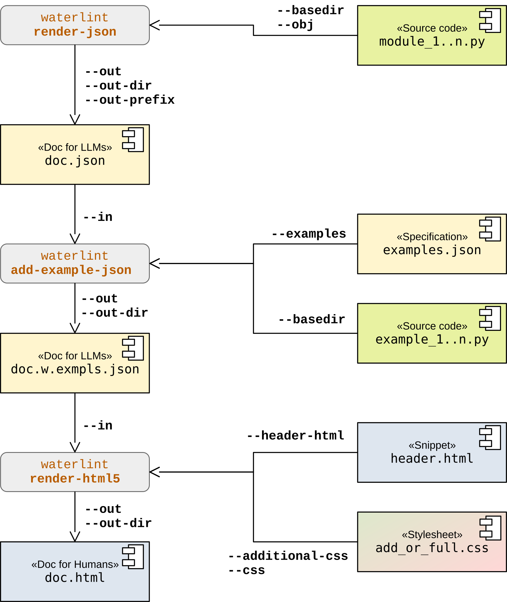

Overview: I/O Layers
====================

This section is informative.

The following diagram illustrates the typical workflow for generating
both LLM-readable and human-readable documentation, including the
integration of code examples. It highlights the transformation from
source code to structured JSON artifacts and finally to rendered HTML.

The individual stages of this workflow are described in detail in
sections :ref:`json_io_layer` and :ref:`html_output_layer`.

