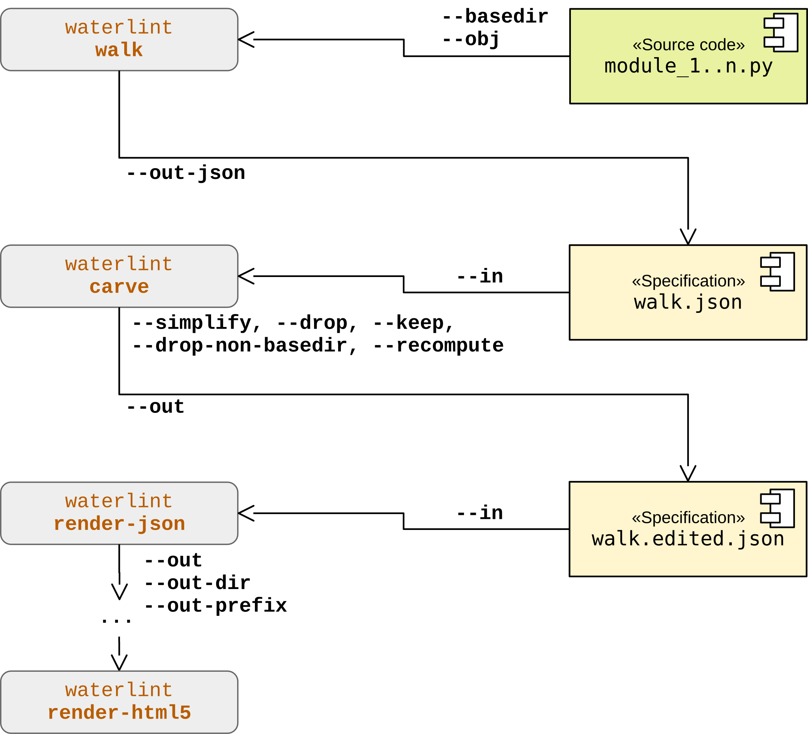

Overview: I/O Layers
====================

This section is informative.

The following diagram illustrates the typical workflow for generating
both LLM-readable and human-readable documentation, including the
integration of code examples. It highlights the transformation from
source code to structured JSON artifacts and finally to rendered HTML.

The individual stages of this workflow are described in detail in
sections :ref:`json_io_layer` and :ref:`html_output_layer`.

.. image:: ../img/waterlint_pipeline.svg
	:alt: Workflow for waterlint's JSON/HTML output layer
	:align: center

:wtrl_cmd:`waterlint` provides a mechanism to control and refine the
set of objects included in generated documentation artifacts.
This functionality is implemented by the combination of the
subcommands :wtrl_cmd:`walk` and :wtrl_cmd:`carve`.

The command :wtrl_cmd:`walk` expects one or more modules located
within a common base directory and traverses all reachable documented
objects.

The output (text or JSON) represents the discovered object graph.
The text output is intended for human inspection, while the JSON
output provides a machine-readable intermediate representation suitable
for further processing.

By default, each entry contains fields such as:

* :wtrl_value:`qualname` -- qualified name of the object
* :wtrl_value:`kind` -- object category (module, class, function, ...)
* :wtrl_value:`scope` -- visibility scope as defined in this document
* :wtrl_value:`file` -- path to the module containing the object
* :wtrl_value:`lineno` -- source line number of the object definition
* :wtrl_value:`included` -- whether the object participates in a valid Waterloo artifact
* :wtrl_value:`reason` -- reason for exclusion (e.g. :wtrl_value:`no_doc`, :wtrl_value:`invalid`)

In text mode, file paths are compacted and accompanied by a legend.
In JSON mode, paths are represented canonically.

The JSON output is described by schema

	:wtrl_file:`wtrl-walk-json-*.*.*.schema.json`

and can be validated using

	:wtrl_cmd:`waterlint validate-json`

The command :wtrl_cmd:`carve` provides a set of editing and projection
operations for walk JSON artifacts. In particular, the
:wtrl_opt:`--drop` and :wtrl_opt:`--keep` options allow selective
inclusion or exclusion of namespaces by qualified-name prefix chains.

Conceptually, :wtrl_cmd:`carve` acts as an operator transforming one
walk JSON artifact into another walk JSON artifact.

The resulting JSON artifact can then be passed directly to
:wtrl_cmd:`waterlint render-json` instead of specifying modules
explicitly, as illustrated in the following diagram.

