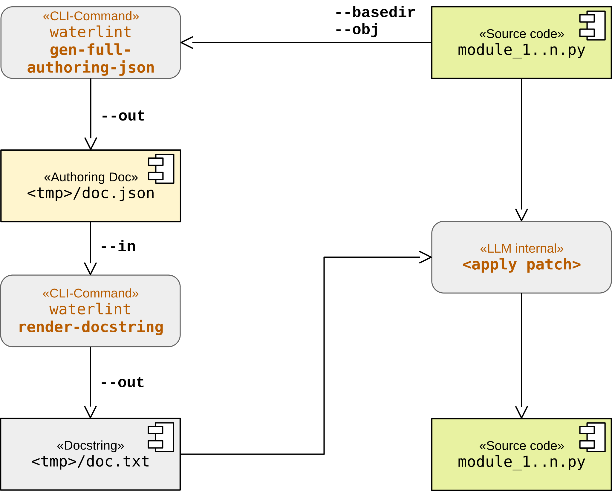

Overview: I/O Layers
====================

This section is informative.

From source to HTML
-------------------

The following diagram illustrates the typical workflow for generating
both LLM-readable and human-readable documentation, including the
integration of code examples. It highlights the transformation from
source code to structured JSON artifacts and finally to rendered HTML.

The individual stages of this workflow are described in detail in
sections :ref:`json_io_layer` and :ref:`html_output_layer`.

.. image:: ../img/waterlint_pipeline.svg
	:alt: Workflow for waterlint's JSON/HTML output layer
	:align: center

Walk and carve
--------------

:wtrl_cmd:`waterlint` provides a mechanism to inspect, filter, and refine
the set of objects that enter the documentation pipeline. This functionality
is implemented by the combination of the subcommands :wtrl_cmd:`walk` and
:wtrl_cmd:`carve`.

The command :wtrl_cmd:`walk` expects one or more modules located within a
common base directory and traverses all reachable documented objects. Its
output is a canonical intermediate JSON artifact that reflects the current
object graph and visibility state of the source tree.

This artifact is useful as a source of truth for later processing, but it is
not intended as a general exchange format. Many entries are tied to concrete
filesystem paths and local name resolution, so the resulting JSON is highly
meaningful within the originating tree but not portable across unrelated
environments.

The output (text or JSON) represents the discovered object graph. The text
output is intended for human inspection, while the JSON output provides a
machine-readable intermediate representation suitable for further processing.

By default, each entry contains fields such as:

* :wtrl_value:`qualname` -- qualified name of the object
* :wtrl_value:`kind` -- object category (module, class, function, ...)
* :wtrl_value:`scope` -- visibility scope as defined in this document
* :wtrl_value:`file` -- path to the module containing the object
* :wtrl_value:`lineno` -- source line number of the object definition
* :wtrl_value:`included` -- whether the object participates in a valid Waterloo artifact
* :wtrl_value:`reason` -- reason for exclusion (e.g. :wtrl_value:`no_doc`, :wtrl_value:`invalid`)

In text mode, file paths are compacted and accompanied by a legend.
In JSON mode, paths are represented canonically.

The JSON output is described by schema

	:wtrl_file:`wtrl-walk-json-*.*.*.schema.json`

and can be validated using

	:wtrl_cmd:`waterlint validate-json`

The command :wtrl_cmd:`carve` provides a deliberate editing and projection
layer for walk JSON artifacts. In particular, the :wtrl_opt:`--drop` and
:wtrl_opt:`--keep` options allow selective inclusion or exclusion of
namespaces by qualified-name prefix chains.

Conceptually, :wtrl_cmd:`carve` acts as an operator transforming one walk
JSON artifact into another walk JSON artifact. It preserves the canonical
schema shape, but may simplify, filter, and recompute derived summary data.

The resulting JSON artifact can then be passed directly to
:wtrl_cmd:`waterlint render-json` instead of specifying modules explicitly,
as illustrated in the following diagram.

.. image:: ../img/waterlint_pipeline_carve.svg
	:alt: Walk, carve, and render
	:align: center

Authoring JSON
--------------

Early experience with the Waterloo Docstring format showed that LLMs can find
some syntactic rules difficult to control reliably. In particular, contract
items such as :wtrl_label:`Contract.general`,
:wtrl_label:`Contract.constructor`, :wtrl_label:`Contract.requires`, and
:wtrl_label:`Contract.ensures` express one logical statement across one or
more physical lines. Free-form sections have a related issue: paragraphs are
separated with the Waterloo ``|`` marker, whereas LLMs commonly introduce a
blank physical line.

For these reasons, :wtrl_cmd:`waterlint` 0.23.0 introduces Authoring JSON and
its accompanying schema. The format represents the semantic structure of one
Waterloo docstring as a strictly validated JSON object. A deterministic
renderer subsequently translates that object into the final Waterloo
Docstring format. Each Authoring JSON document describes exactly one Python
object, such as a module, class, function, or method.

The fixed JSON structure prevents many purely structural mistakes before a
docstring is rendered. It does not replace the final validation cycle: only
the real Python object supplies source-specific facts such as its signature,
exception classes, references, scopes, and allowed sections.

The Authoring JSON format is validated by the distributed schema file

	:wtrl_file:`wtrl-authoring-object-json-*.*.*.schema.json`

The following :wtrl_cmd:`waterlint` subcommands work with Authoring JSON:

* :wtrl_cmd:`validate-json` validates Authoring JSON as well as the other
  supported JSON artifact formats.
* :wtrl_cmd:`gen-minimal-authoring-json` generates the required initial
  structure for one Python object.
* :wtrl_cmd:`gen-full-authoring-json` generates all profile-allowed structure
  that can be derived without inventing list entries or other identifiers.
* :wtrl_cmd:`render-docstring` renders Authoring JSON as raw Waterloo
  docstring content.

In practice, an LLM authors a docstring as follows:

* Start from a Python object identified by :wtrl_opt:`--basedir` and
  :wtrl_opt:`--obj`.
* Generate a complete editable starting point with
  :wtrl_cmd:`waterlint gen-full-authoring-json`. Edit its ``doc`` object and
  use :wtrl_cmd:`waterlint validate-json` when an explicit JSON validation
  step is useful.
* Render the document with :wtrl_cmd:`waterlint render-docstring`. The
  renderer turns paragraphs, lists, indentation, physical lines, and
  continuation backslashes into their canonical Waterloo representation.
* Insert the rendered content as the Python docstring and validate the real
  target with :wtrl_cmd:`waterlint validate`.
* If validation reports a problem, correct the Authoring JSON and repeat the
  rendering and target-validation steps. Keeping corrections in the Authoring
  JSON prevents the source docstring and its editable representation from
  drifting apart.

The :wtrl_lit:`draft_docstring` MCP prompt ("Draft a Waterloo docstring")
recommends this workflow to LLM clients. The following diagram shows the
successful path without validation failures:

