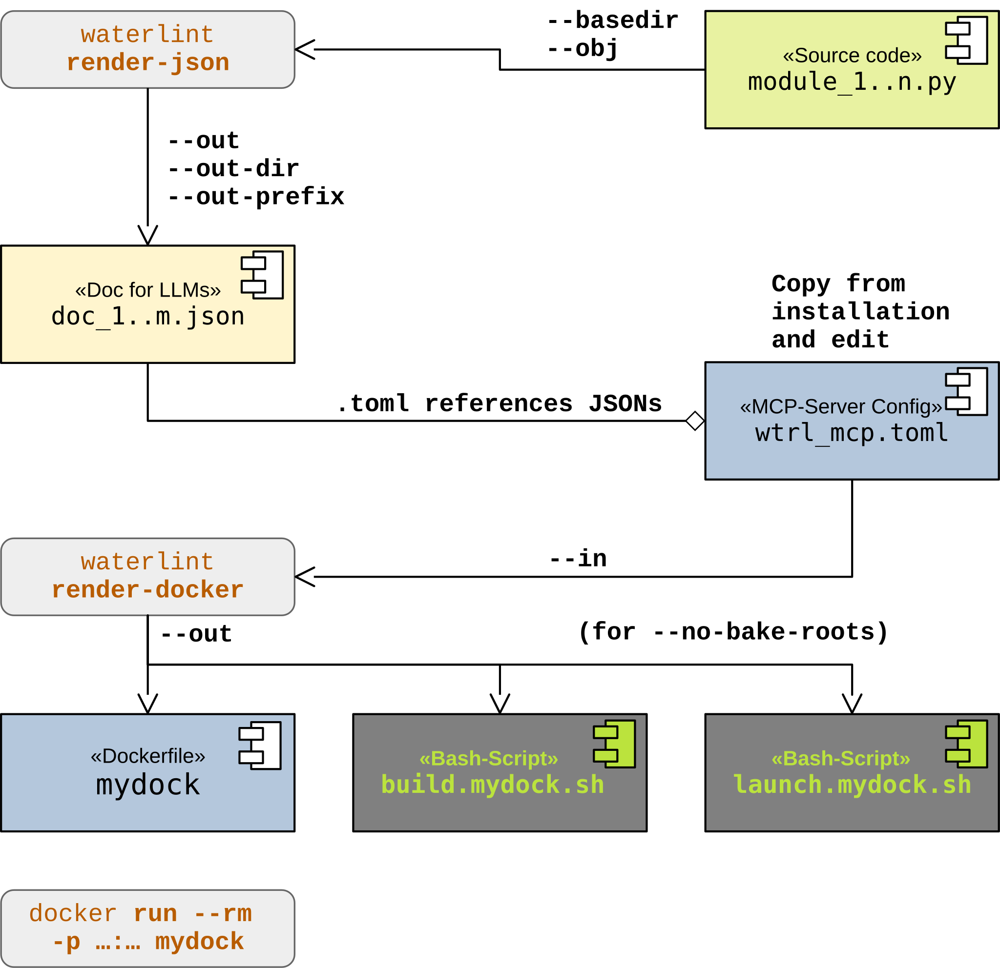

Model Context Protocol
======================

Model Context Protocol, usually abbreviated MCP, is a simple way for an
application to expose tools and structured data to an LLM-based client.
Instead of asking the model to inspect files directly, the client talks to a
server that offers named tools such as discovery, lookup, and read-only data
access.

From the user's point of view, MCP is mostly an interoperability layer:
the client knows which tools exist, how to call them, and how to interpret
the results. The server keeps the actual data and behavior behind a small,
documented interface.

For Waterloo, that interface is used to expose JSON-based documentation data
and a small set of helper tools that make large documentation trees easier to
navigate from an LLM agent or a visual inspector.

The Waterloo MCP-Server
-----------------------

The Waterloo MCP-server applies that pattern to Waterloo documents in JSON
format. It gives LLM-agents a simple, standardized way to access and query the
documentation without loading the whole data set into the context window.
The server is implemented as a simple HTTP server that listens for JSON-RPC
requests and responds with JSON data. It can be integrated with LLM-agents
that support JSON-RPC.

Executable and configuration
----------------------------

The Waterloo package includes a ready-to-use configuration file for the MCP
server at :wtrl_file:`etc/wtrl_mcp.http.toml`.
Once the package is installed, the server can be started in a terminal with
the following command:

.. code-block:: bash

	wtrl_mcp --config etc/wtrl_mcp.http.toml

If the argument to :wtrl_cmd:`--config` is an absolute path, it is used as is.
If it is a relative path, :wtrl_cmd:`wtrl_mcp` first looks for the file
relative to the current working directory and then relative to the installed
Waterloo package root. The usual package-local configuration path is therefore
prefixed with :wtrl_file:`etc/`. If neither candidate exists, the server reports a
clear configuration error and exits.

Tools
-----

The MCP-server supports the following tools:

.. rubric:: Tool discovery

- :wtrl_cmd:`describe_tool` — reads the Waterloo signature and docstring for one MCP tool.

.. rubric:: Root discovery and inventory

- :wtrl_cmd:`list_roots` — lists the configured Waterloo data roots.
- :wtrl_cmd:`get_root` — reads one configured Waterloo data root by :wtrl_var:`root_id`.
- :wtrl_cmd:`list_objects` — lists all Waterloo objects in one configured root.

.. rubric:: Object content access

- :wtrl_cmd:`get_object` — reads one Waterloo object by :wtrl_var:`qid` from a configured root.
- :wtrl_cmd:`get_section` — reads one stored section of one Waterloo object.
- :wtrl_cmd:`get_subsection` — reads one stored subsection of one Waterloo object.
- :wtrl_cmd:`get_signature` — reads the stored signature block for one Waterloo object.

.. rubric:: Reference and graph lookup

- :wtrl_cmd:`get_references` — reads structured incoming :wtrl_label:`See_also` references for one Waterloo object.
- :wtrl_cmd:`search_related` — reads the star-shaped :wtrl_label:`See_also` neighborhood for one Waterloo object.

.. rubric:: Example lookup

- :wtrl_cmd:`get_examples` — reads structured example metadata for one Waterloo object.
- :wtrl_cmd:`get_example_source` — reads the source text for one canonical Waterloo example reference.

.. rubric:: Search tools

- :wtrl_cmd:`search_objects` — searches Waterloo objects by expression and structural filters.
- :wtrl_cmd:`search_sections` — searches Waterloo section and subsection labels by expression and structural filters.
- :wtrl_cmd:`search_text` — searches Waterloo text content by terms and structural filters.

.. rubric:: Authoring helper

- :wtrl_cmd:`gen_docstring` — generates a Waterloo docstring template for a given profile, with optional signature, template mode, and indentation mode.

Typical agent workflow
----------------------

The tools above are the catalog; the workflow below is a recommended way to
approach them when the agent does not already know the exact tool or target.
In practice there are two common starting points:

* discover the MCP tool set itself with :wtrl_cmd:`describe_tool`
* discover Waterloo content with :wtrl_cmd:`list_roots`

The lookup-oriented tools are then meant to be used in a simple progression.
This is only a recommended progression; agents that already know the target can
jump directly to the relevant :wtrl_cmd:`get_*` or :wtrl_cmd:`search_*` tool.

1. :wtrl_cmd:`list_roots` to discover available roots.
2. :wtrl_cmd:`describe_tool` when the agent wants to inspect the signature and Waterloo docstring of one MCP tool.
3. :wtrl_cmd:`list_objects` to inventory the objects in one root before drilling down.
4. :wtrl_cmd:`search_objects` to find candidate objects and obtain stable ``root_id`` / ``qid`` pairs.
5. :wtrl_cmd:`get_section` or :wtrl_cmd:`get_subsection` to inspect the relevant contract, notes, or other structured sections.
6. :wtrl_cmd:`search_sections` when the agent wants to find section or subsection labels rather than object names.
7. :wtrl_cmd:`get_signature` when the agent wants to inspect the canonical stored signature for one object.
8. :wtrl_cmd:`get_references` when the agent wants to inspect incoming structured See_also references for one object.
9. :wtrl_cmd:`search_related` when the agent wants a compact star-shaped See_also neighborhood around one object.
10. :wtrl_cmd:`get_examples` when the agent wants to inspect available example references for one object.
11. :wtrl_cmd:`get_example_source` when the agent wants to retrieve the raw source text for one canonical example reference.
12. :wtrl_cmd:`search_text` when the agent wants to search the actual content text with a small set of terms.
13. :wtrl_cmd:`gen_docstring` when the agent wants to draft or refine a Waterloo docstring template for a profile.

In practice this means that the agent can start with a vague name, narrow it
down to a canonical target, and then inspect the exact Waterloo text that
describes the object.

Using the MCP-server in VSCode
------------------------------

.. rubric:: HTTP transport

[Last tested with VSCode 1.115.0 on 2026-05-31]

With transport :wtrl_lit:`streamable-http`, the MCP-server is added to VSCode by:

	:wtrl_key:`Shift+Ctrl+P` and :wtrl_lit:`MCP: Open User Configuration`

The code to be added should look like

.. code-block:: json

	{
	    "servers": {
	    	"waterloo-docs": {
	        	"type": "http",
	        	"url": "http://127.0.0.1:13316/mcp"
	     	}
	    }
	}
	
where the :wtrl_attr:`url` is the URL of the MCP server. Use the host and port
from the running server configuration, and make sure the URL matches the
configured :wtrl_lit:`streamable-http` endpoint. The MCP server must be
running and accessible at that URL for the integration to work. As a smoke
test, open the MCP panel in VSCode and see whether it connects successfully.
Then ask Copilot to run :wtrl_cmd:`list_roots` and check whether it returns the
expected list of documents.

.. rubric:: Stdio transport

With transport :wtrl_lit:`stdio`, the setup is usually more convenient for
day-to-day use because no separate terminal and no TCP port are needed. If the
Waterloo extension and the Python package :wtrl_file:`sdv.doc.waterloo` are
installed, VSCode can talk to the MCP-server directly through the stdio
transport. The extension contributes the server automatically, so the user does
not need to add a JSON server definition by hand.

The default configuration lives in :wtrl_file:`etc/wtrl_mcp.stdio.toml`. If you
want to customize the roots or other settings, make a copy of that file and
point VSCode to the copy. Open the command palette with
:wtrl_key:`Shift+Ctrl+P`, choose :wtrl_lit:`MCP: Open User Configuration`, and
then set :wtrl_lit:`waterloo.mcpConfigPath` to your copied stdio configuration.
The path may be absolute (recommended) or relative; if it is relative, the extension also
looks in the open workspace and in the installed Waterloo package root.

If you want to disable the automatic MCP server contribution entirely, set
:wtrl_lit:`waterloo.mcpProvideServer` to ``false``. Otherwise the extension will
use the configured command and configuration path, with sensible defaults when
no custom path is given.

After saving the settings, open the MCP panel in VSCode and check whether the
server appears. As a smoke test, ask Copilot to run :wtrl_cmd:`list_roots` and
verify that the expected roots are returned.

Server error messages
---------------------

This section is normative.

The MCP implementation currently returns textual tool errors through the
FastMCP transport path. The Waterloo-specific error payload classes are kept
as a draft in :wtrl_file:`mcp/wtrl_error.py`, but the wire-level structure is
not normative yet.

The current lookup-oriented rule family is:

* [MCPS-001] -- unknown or missing ``root_id``.
* [MCPS-002] -- unknown ``qid``.
* [MCPS-003] -- unknown section name.
* [MCPS-004] -- unknown subsection name.
* [MCPS-005] -- root document too large for the ``get_root`` guardrail.
* [MCPS-006] -- unknown example reference.
* [MCPS-007] -- unknown tool name.

The current implementation already prefixes tool error messages with these
rule labels. A later version may map them more directly to structured
JSON-RPC error payloads if the MCP SDK exposes a better hook for that.

Running the MCP-Server in a Docker container
--------------------------------------------

Um einen MCP-Server plattformunabhaengig bereitstellen zu koennen, bietet
:wtrl_cmd:`waterlint` die Moeglichkeit, aus einer MCP-Server-Konfiguration
ein Dockerfile und je nach Modus ein oder zwei bash-Skripte zu generieren.

Das Subcommand hierfuer ist :wtrl_cmd:`render-docker` und die grundlegene
Aufrufsyntax ist:

.. code-block:: bash

	waterlint render-docker --in /path/to/mcp.toml --out /path/to/dockerfile

Die beiden Modi sind:

* :wtrl_opt:`--no-bake-roots` -- Die Rootdokumente werden soft in den Container ge-mount'et.
* :wtrl_opt:`--bake-roots` (default) -- Die Rootdokumente werden in das Dockerimage gebacken.

Weitere Optionen sind in der :wtrl_cmd:`waterlint`-Onlinehilfe beschrieben.

Um zu entwickeln bzw. die Dokumentation eines Projekts voranzutreiben, verwenden man den Modus
:wtrl_opt:`--no-bake-roots`, so dass man in einem Arbeits- und Testzyklus das Dockerimage
nicht neu bauen muss, sondern einfach den Container neu starten kann. Fuer diesen Modus ist
das Starten des Containers von Hand umstaendlich, daher erzeugt :wtrl_cmd:`waterlint render-docker`
fuer diesen Modus ein Launch-Skript, das den Container im Vordergrund startet und nach :wtrl_lit:`stdout` loggt.

Fuer den Wirkbetrieb (Deployment) wird man den Modus :wtrl_opt:`--bake-roots`
verwenden, damit nur ein einziges File -- das Dockerimage -- bereitgestellt werden muss.
:wtrl_cmd:`waterlint render-docker` listet nach dem Generieren der Files
ein paar einfache Docker-Aufrufe auf, beispielsweise um den Container
als Daemon zu starten. 

Der Ablauf zum Erzeugen des Dockerfiles und der Skripte ist im folgenden
Diagramm dargestellt:

